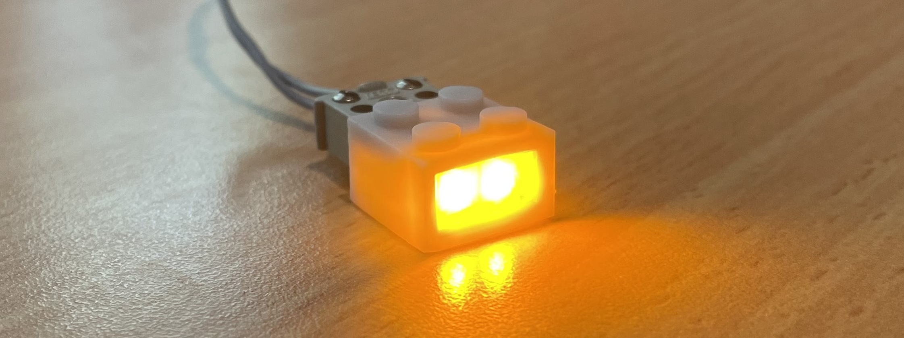
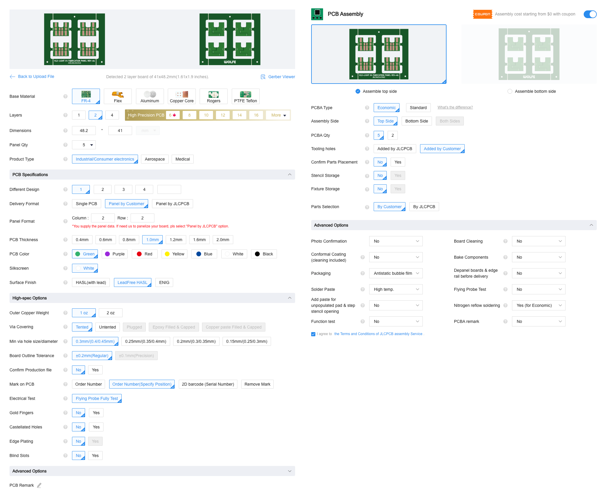
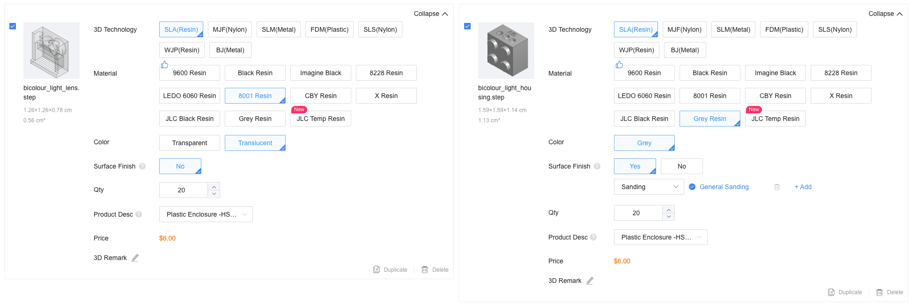

# Bicolour Light

### A bicolour LED version of the 12V 2x2 light brick.

The brick contains two red/yellow bicolour LEDs which change colour with input polarity. This brick is intended for use in locomotives/rolling stock to produce a headlight/tail-light changeover with direction.

### Features

- Identical formfactor to the original 2x2 12V light brick (08010bc01).
- Version with 3-hole socket.
- Colour change red-yellow with input polarity.
- Improved brightness over original, particularly in the lower voltage range.

### Specifications

| PARAMETER | VALUE | UNIT | CONDITION |
| --------- | ----- | ---- | --------- |
| V_max | 12 | V | |
| I_max | 39 | mA | V = 12V |
| W_red | 625 | nm | Individual; IF = 20mA |
| W_yel | 585 | nm | Individual; IF = 20mA |

## Usage Information

The position of the LEDs is ideal for use with light prism assemblies (4170/4171). Each LED is positioned directly behind its respective light prism, allowing for the majority of light to be guided to the exterior stud. The combination of LED positioning and efficiency results in an overall brighter effect than the original bulbs. The chosen colours of red/yellow mimic the original colours of the bulb bricks when combined with red/yellow studs. As such, it is recommended to use clear studs instead of the original tinted studs on the light prisms for the best effect.

**NOTE:** As a consequence of using forward-facing LEDs, light is almost entirely directed forward. This makes the bricks ineffective for downward lighting, such as within train interiors or affixed as station lampposts.

## Ordering Information

Parts can be ordered through JLCPCB/JLC3DP using the included production files. You can produce your own production files for a different service using the KiCAD source projects.

**NOTE:** You are ordering these items at **your own risk**! While care is taken to ensure projects are complete and functional, mistakes and errors are always possible. The creators of this project do not hold any liability or responsibility for items you have had produced from this repository.

## Ordering PCBA

The production files are for a panel containing 4 individual PCBs. As such, the ordered quantity will be `4 * n_panel`. If you order 5 PCBs/Panels, for example, you will receive 20 individual PCBs to produce 20 bicolour light bricks.

- Upload `/hardware/production_files/bicolour_light_X4.zip` to the JLCPCB ordering page with these **changed** options:
    - **PCB (Panel) Quantity** - Your choice! (default 5).
    - **Delivery Format** - Panel By Customer
    - **Panel Format** - Column: **2** - Row: **2**
    - **PCB Thickness** - 1.0mm
    - (optional) **Surface Finish** - LeadFree HASL
    - **Mark on PCB** - Order Number (Specify Position)
- Enable "PCB Assembly"
    - **PCBA Quantity** - Your choice! (default 5)
    - **Tooling Holes** - Added by Customer
- Check options with the image below; proceed with "Next"
- Check the displayed PCB and proceed with "Next"
- Upload the following files and select the following option:
    - **Add BOM File:** - `/hardware/production_files/bicolour_light_BOM.xlsx`
    - **Add CPL File:** - `/hardware/production_files/bicolour_light_X4_POS.xlsx`
    - **File provided as:** - Complete File
- Proceed with "Process BOM & CPL"
- Check the supplied inventory (see PCBA Issues) and proceed with "Confirm"
- Check placement (see PCBA Issues) and add to cart - Done!

**NOTE:** When paying for your PCBA order, you should have access to a $9 discount coupon - this can offset the cost of PCBA for a small order.

### PCBA Issues

The LED used is an uncommon part and will likely have no active inventory in the PCBA system. You can pre-order the LED through JLCPCB's part system; this will guarantee inventory for when you place your PCBA order. The LCSC part number is [C7545694](https://jlcpcb.com/partdetail/XINGLIGHT-XLC4040SURUYC/C7545694).

The placement origin of the LED differs within the PCBA service than the KiCAD footprint. This will result in the LEDs placement being slightly forward. Please correct this in the placement view, or select "Confirm Parts Placement" when ordering. The correct placement is 0.25mm inset from the board edge (you can approximate this in the placement view).

## Ordering 3D Parts

3D models are supplied in `.step` format for portability. JLC3DP accepts `.step` files for 3D printing, though many slicers for home printing do not. If you would like to print these files yourself, you will need to re-export them to `.stl` using a CAD package of your choice. Follow the below procedure for ordering parts using JLC3DP:

- Upload the following files to the JLC3DP ordering page and select their respective options:
    - `/mechanical/bicolour_light_housing.step`
        - **3D Technology** - SLA (Resin)
        - **Material** - Gray Resin
        - **Surface Finish** - Yes - Sanding
        - **QTY** - Your choice! Match the number of _individual_ PCBs ordered
        - **Product Desc** - Enclosure -> Plastic Enclosure
    - `/mechanical/bicolour_light_lens.step`
        - **3D Technology** - SLA (Resin)
        - **Material** - 8001 Resin
        - **Color** - Translucent
        - **Surface Finish** - No
        - **QTY** - Your choice! Match the number of _individual_ PCBs ordered
        - **Product Desc** - Enclosure -> Plastic Enclosure
- Add to cart - Done!

**NOTE:** The lens pieces made in 8001 Resin are considered "small parts". You will receive an error if you attempt to order them with a surface finish.

### 3D Part Issues

There is a possibility that you will be contacted regarding manufacturability after placing an order. This is typically due to the "12V" text legibility on the rear of the housing. The precision of this text is not crucial; you can respond to the inquiry stating that you accept the possibility of defects. Even when not explicitly highlighted by JLC, any resin printed part can possess defects such as scratches, warping/deformation, variance in finished size, etc. Two orders of the same parts will result in slight differences. The models have been designed with sufficient tolerance, though you may still need to perform some finishing for a proper assembled fit. This variance also affects the clutch power of the bricks when binding with Lego original parts - some will be a little tight, others a little loose.

## Assembly Instructions

These instructions assume you have ordered parts using the instructions above. The required processing and finishing will differ if you have printed the 3D parts yourself.

1. Depanelize the PCBs by breaking along the mousebites. Break the edge rails first, then break the PCBs from the inner frame.
2. Deburr the broken mousebites by running a sharp blade along their edges. Be careful not to cut the PCB itself. Ensure you do this on a suitable cutting surface where you can safely contain and dispose of the PCB fragments.
3. Check the underside of the 3D printed lens - you may need to sand the antistud for appropriate binding force. There may be residual artifacts from printing on the antistud side - gently sand these away.
4. Place a PCB into the lens with the LEDs occupying the corrugated cavity. The unpopulated side should be facing up.
5. Insert the lens-PCB assembly into the housing. You will need to use a small amount of force to overcome the three housing clips. Once located, ensure the three clips are securely fastened over the lens.

**NOTE:** For any sanding of 3D printed parts, it is best to use a fine-grit emery board. Sand gently and check fitment often so as not to remove excess material. Clean sanded parts with a toothbrush to remove dust residue.